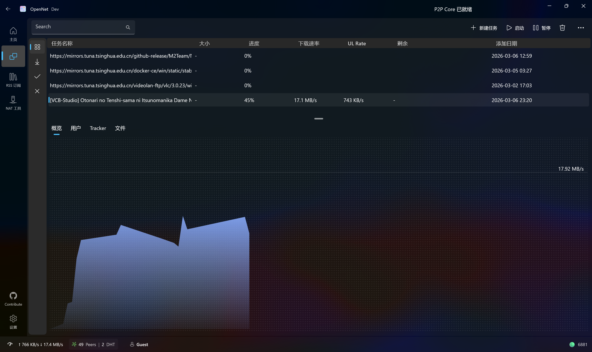
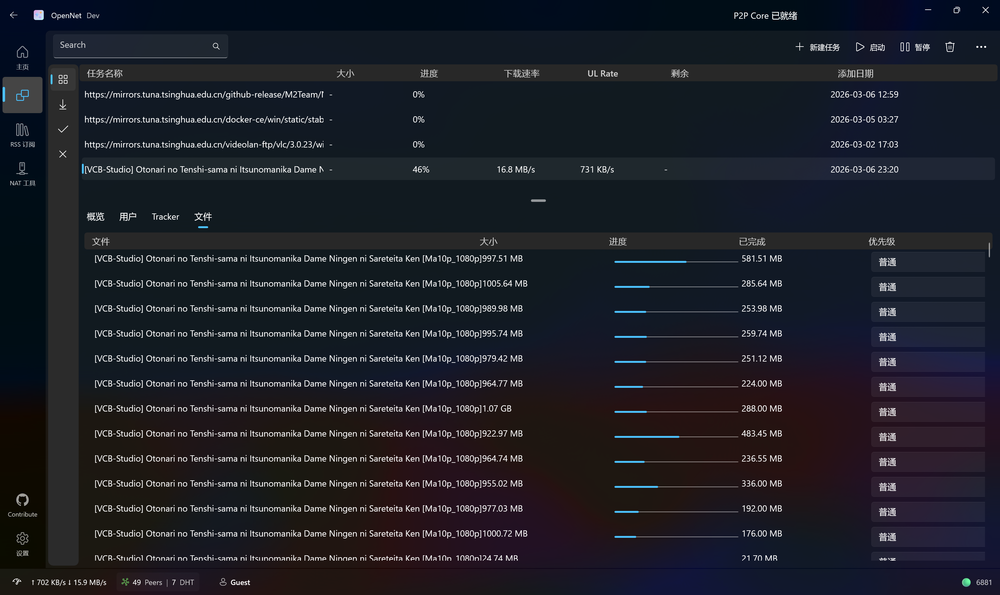
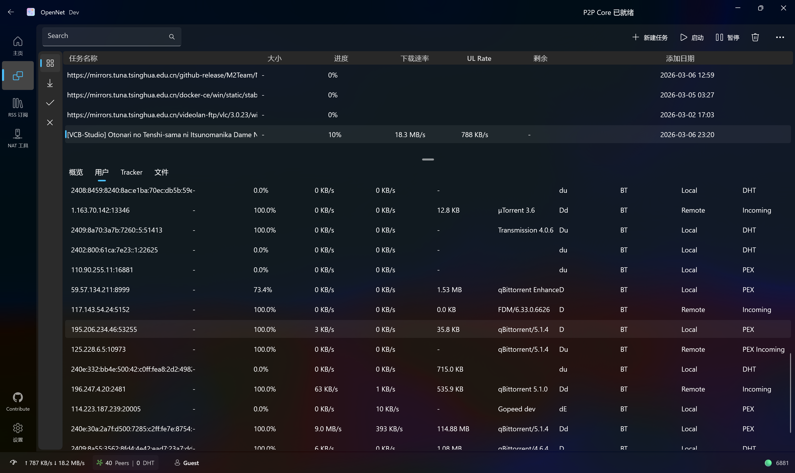



🎉Welcome to the OpenNet project

  

[简体中文](README_zh-CN.md)

## Overview

Our current framework is WinUI3 with C++/WinRT. Using WinUI3 allows us to create modern Windows applications with a contemporary look and feel, while C++/WinRT provides improved user experience and performance.  
Currently, we plan to run only on Windows. Cross-platform support may be considered in the future (for cross-platform native apps using the MAUI build system and cross-platform calls via P/Invoke).  
The main open-source library we currently use are `libtorrent` and `aria2`.

## Support platforms
- windows 11 ARM64/x64
- windows 10 is not in my support plan, but it can still run but may occur some issues, include core functions error, UI display issues, report them if you have one.

## How to build the debug project

1. Development environment requirements

* Windows 11 25H2 or later — we recommend using the latest version of Windows 11.
* Visual Studio 2026 (Latest).
* More than 64GB RAM is adviced(or increase your machine virtual memory - Auto management is not stable). Machine with less RAM may still build the project, but your code and debug experience may be impacted.
* Workloads: C++ Desktop Development, WinUI Desktop Development, and C++ WinUI app tools.
* Windows 11 SDK (10.0.26100.0 or later)
* MSVC v145/MSVC preview(or open solution and follow vs install prompts)
* `vcpkg` package manager (the VS-integrated version is acceptable)
* You may need to have [vcpkg](https://vcpkg.io/) installed and integrate setup for msbuild. See [this documentation for guide](https://learn.microsoft.com/vcpkg/get_started/get-started-msbuild?pivots=shell-powershell).

2. Build the project

* Open Visual Studio and choose to clone the repository.
* Enter the project's Git repository URL and choose a local path with more than 30GB free space (Strongly advise fast SSD). Avoid spaces and non-ASCII characters in the path, as some older dependencies may fail. Then click "Clone". If your network is unreliable, consider using SSH or a TUN proxy for Git.
* Open OpenNet.slnx in Visual Studio.
* In Solution Explorer, ensure the bolded project is `OpenNet` and configured as the startup project.
* Click the green Start button to begin debugging and launch the application.
* On first run, the application will automatically download required NuGet and `vcpkg` dependencies and build them. This may take some time depending on configuration (around 30–60 minutes). Since `vcpkg` is hosted on GitHub, use a proxy if your network is restricted.

## Features

* Support for downloading via BitTorrent using `.torrent` files/magnet links and http/https download.
* RSS subscription and automatic downloading.
* Nat tools to check network status.

## Preview
**NOT THE FINAL PRODUCT**

## Roadmap

* Support for HTTP/HTTPS/FTP file downloads.
* Support for automatic NAT traversal.
* Support for distributed network features such as DHT, PEX, and LSD.
* Support for NAT detection.
* Support for remote control.
* Support for user login and multi-user management.

## Learn about the project

## 🌍 Localization

OpenNet uses [Crowdin](https://crowdin.com/project/opennet/) as a client text translation platform where you can submit translated text for languages you are familiar with.
We are grateful to every community member who has contributed to OpenNet and welcome more friends to participate in this project.  
 

## Special thanks

MVVM framework: @https://github.com/AlexAdasCca

## ⚙️ Tech Stack

- [arvidn/libtorrent](https://github.com/arvidn/libtorrent)
- [dotnet/runtime](https://github.com/dotnet/runtime)
- [getsentry/sentry-native](https://github.com/getsentry/sentry-native)
- [HO-COOH/WinUIEssentials](https://github.com/HO-COOH/WinUIEssentials)
- [lgztx96/CommunityToolkit.WinUI](https://github.com/lgztx96/CommunityToolkit.WinUI)
- [microsoft/vs-validation](https://github.com/microsoft/vs-validation)
- [microsoft/WindowsAppSDK](https://github.com/microsoft/WindowsAppSDK)
- [microsoft/microsoft-ui-xaml](https://github.com/microsoft/microsoft-ui-xaml)
- [microsoft/vcpkg](https://github.com/microsoft/vcpkg)
- [Millennium-Science-Technology-R-D-Inst/WinUI3-cppwinrt-MVVM](https://github.com/Millennium-Science-Technology-R-D-Inst/WinUI3-cppwinrt-MVVM)
- [openssl/openssl](https://github.com/openssl/openssl)
- [PBH-BTN/PeerBanHelper](https://github.com/PBH-BTN/PeerBanHelper)
- [ProjectMile/Mile.Aria2](https://github.com/ProjectMile/Mile.Aria2)

## 📈 Development

## Star History
<a href="https://www.star-history.com/?repos=hoshiizumiya%2FOpenNet&type=date&legend=top-left">
 <picture>
   <source media="(prefers-color-scheme: dark)" srcset="https://api.star-history.com/chart?repos=hoshiizumiya/OpenNet&type=date&theme=dark&legend=top-left&sealed_token=8qJLBt5Sgjh6datJom0AhvyH_QtUHNJSuGq1GCNihQ2ftZAjGs4r9jHYoHHrcAr4thNhwAcVE8FJLDNEYeqmx_m2EvWDF4RTiMItU6No_dbfhtzgd1KWRw" />
   <source media="(prefers-color-scheme: light)" srcset="https://api.star-history.com/chart?repos=hoshiizumiya/OpenNet&type=date&legend=top-left&sealed_token=8qJLBt5Sgjh6datJom0AhvyH_QtUHNJSuGq1GCNihQ2ftZAjGs4r9jHYoHHrcAr4thNhwAcVE8FJLDNEYeqmx_m2EvWDF4RTiMItU6No_dbfhtzgd1KWRw" />
   
 </picture>
</a>

## Contribute

MVVM framework: @https://github.com/AlexAdasCca
