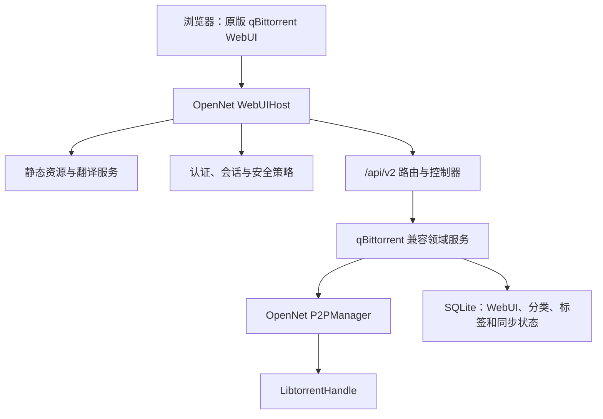

# OpenNet qBittorrent WebUI 完整兼容设计

状态：拟实施  
设计基线：qBittorrent `78bf5f0c715b447c4ca1127e3aae7cd3c2f0e90b`  
WebAPI 基线：`2.16.0`  
适用项目：`C:\Files\OpenNet\OpenNet`

## 1. 决策

OpenNet 不再开发和维护第二套 Torrent Web 前端。内置 WebUI 直接复用 qBittorrent 的 `src/webui/www`，OpenNet 只实现：

1. 与 qBittorrent WebAPI v2 相同的 HTTP、认证、静态资源和数据语义；
2. qBittorrent WebAPI 与 OpenNet/libtorrent 之间的适配层；
3. 极少量独立补丁，用于品牌、OpenNet 扩展入口和阶段性能力开关；
4. 上游同步、契约提取、差异测试和浏览器测试工具。



“完全兼容”不是页面能够打开，而是以下四层同时成立：

- 资源兼容：未经分叉的上游页面能完整加载；
- 协议兼容：路径、方法、参数编码、状态码、响应头和 JSON 类型一致；
- 数据兼容：字段名称、单位、缺省值、状态字符串、增量删除语义一致；
- 行为兼容：原版 WebUI 的每个可见操作都能得到与 qBittorrent 等价的结果。

阶段性隐藏未实现入口只用于开发过程，不算最终兼容。

## 2. 范围与非目标

### 2.1 纳入范围

- 原样复用 `public`、`private`、`translations`、测试和 WebUI 构建配置；
- 支持当前基线的全部 128 个 WebAPI action；
- 支持 Cookie、Basic Auth 和 Bearer API Key 三种会话入口；
- 支持桌面程序生命周期、MSIX 打包、环回访问和可选局域网访问；
- 支持 v1、v2、hybrid Torrent 的 qBittorrent ID 语义；
- 支持多浏览器会话各自独立的 `sync/maindata` 与 `sync/torrentPeers` 增量状态；
- 支持 qBittorrent WebUI 的语言、缓存和动态文本替换；
- 允许以后使用 qBittorrent 的 Alternative WebUI，但默认关闭。

### 2.2 非目标

- 不移植 Qt、qBittorrent `BitTorrent::Session` 或其 C++ Controller；
- 不在上游目录内直接修改 HTML、CSS 或 JavaScript；
- 不保证第三方 Alternative WebUI 使用未公开接口时仍然工作；
- 不以 OpenNet 内部对象的 JSON 序列化结果充当 qBittorrent 响应；
- 不让 WebUI 线程直接持有或操作 `libtorrent::torrent_handle`。

## 3. 许可证发布门

OpenNet 当前根许可证是 CC BY-NC-SA 4.0；qBittorrent 源码是 GPLv2+，包含图片的二进制发行整体为 GPLv3+。仓库还有除主要作者以外的历史贡献。

因此，内置并发布 qBittorrent WebUI 前必须完成以下发布门：

1. 由所有必要的 OpenNet 权利人确认可重新许可的代码范围；
2. 发行物采用 `GPL-3.0-or-later`，或由法律审查确认另一种可行组合；
3. 保留上游每个文件的版权和许可证头；
4. 随发行物包含 qBittorrent 的 `COPYING`、`COPYING.GPLv2`、`COPYING.GPLv3`、`AUTHORS`；
5. 新增 `THIRD_PARTY_NOTICES.md`，记录来源、commit、修改和构建方式；
6. 如果不能完成重新许可，则只能把 WebUI 作为用户自行提供的外部 Alternative WebUI，不能随 OpenNet 二进制内置分发。

本设计不是法律意见。许可证门不阻止兼容层开发和测试，但阻止把上游资源纳入正式发行物。

## 4. 上游资源布局

```text
OpenNet/
├── OpenNet/
│   └── ThirdParty/
│       └── qBittorrentWebUI/
│           ├── upstream/              # src/webui/www 的无修改快照
│           ├── generated/             # 构建或打包时生成，不手工修改
│           ├── patches/               # 可审查的小补丁
│           ├── manifests/
│           │   ├── files.sha256
│           │   └── webapi-2.16.0.json
│           ├── UPSTREAM_COMMIT
│           ├── LICENSES.md
│           └── README.md
├── scripts/
│   ├── Update-QBittorrentWebUI.ps1
│   ├── Build-QBittorrentWebUI.ps1
│   ├── Extract-QBittorrentWebAPI.ps1
│   └── Test-QBittorrentWebUICompatibility.ps1
└── docs/
    ├── qbittorrent-webui-compatibility-design.md
    └── qbittorrent-webapi-compatibility-matrix.md
```

规则：

- `upstream` 必须与 `UPSTREAM_COMMIT` 对应目录逐字节一致；
- 补丁只应用到 `generated`；
- 补丁不能改变 `/api/v2` 请求和响应契约；
- 所有资源使用 SHA-256 清单验证；
- 升级必须同时提交上游 commit、资源差异、API 清单差异和测试结果；
- 测试目录可以不进入 MSIX，运行所需资源必须作为 `DeploymentContent` 打包。

## 5. OpenNet 模块设计

建议全部位于 `OpenNet/Core/WebUI`：

```text
Core/WebUI/
├── WebUIHost.ixx/.cpp
├── WebUISettings.ixx/.cpp
├── Http/
│   ├── HttpServer.ixx/.cpp
│   ├── HttpSession.cpp
│   ├── RequestParser.cpp
│   ├── ResponseWriter.cpp
│   ├── Router.ixx/.cpp
│   ├── FormUrlEncodedParser.cpp
│   └── MultipartParser.cpp
├── Security/
│   ├── AuthenticationService.cpp
│   ├── WebSessionManager.cpp
│   ├── LoginRateLimiter.cpp
│   ├── RequestOriginValidator.cpp
│   └── HostHeaderValidator.cpp
├── Assets/
│   ├── WebAssetService.cpp
│   ├── WebTranslationService.cpp
│   └── MimeTypeProvider.cpp
├── QbtApi/
│   ├── QbtApiRouter.cpp
│   ├── QbtSerializer.cpp
│   ├── QbtTorrentId.cpp
│   ├── QbtStateMapper.cpp
│   ├── QbtSyncService.cpp
│   ├── Controllers/*.cpp
│   └── Contracts/*.ixx
└── Persistence/
    ├── WebClientDataRepository.cpp
    ├── CategoryRepository.cpp
    ├── TagRepository.cpp
    └── WebSessionStateRepository.cpp
```

### 5.1 依赖方向

`WebUIHost -> QbtApi -> IWebTorrentService -> P2PManager -> LibtorrentHandle`

控制器只能依赖 `IWebTorrentService` 等窄接口。这样可以：

- 用内存 fake 做全部 HTTP 契约测试；
- 避免 Web 线程越过 `P2PManager` 的生命周期和锁；
- 保持 WinUI、WebUI 和 Torrent 核心使用同一业务状态；
- 将来替换 HTTP 实现而不影响 API 映射。

### 5.2 生命周期

`WebUIHost` 是进程级服务，不绑定任何 XAML 页面：

1. 应用设置数据库初始化；
2. `P2PManager::EnsureTorrentCoreInitializedAsync()` 完成；
3. 读取 WebUI 设置；
4. 监听端口并开始接受请求；
5. 设置改变时以先启动新监听器、再停止旧监听器的方式切换；
6. 应用退出时先停止接收请求和等待在途请求，再保存 Torrent 状态并关闭核心。

默认设置：

| 设置 | 默认值 |
| --- | --- |
| 启用 | `false`，首次由用户明确开启 |
| 地址 | `127.0.0.1` 与 `::1` |
| 端口 | `8080`，冲突时报告而不静默换端口 |
| TLS | 关闭；非环回监听时 UI 明确警告 |
| 本地免认证 | 关闭 |
| 会话超时 | 3600 秒 |
| CSRF、Host 校验、点击劫持保护 | 开启 |
| 反向代理 | 关闭 |

设置存入 `AppSettingsDatabase` 的新分类 `webui`；密码只保存带独立随机 salt 的 Argon2id 或系统凭据保险库结果，绝不保存明文。

## 6. HTTP 与静态资源语义

### 6.1 HTTP 能力

使用 Boost.Asio + Boost.Beast。`vcpkg.json` 显式加入 `boost-beast`，即使头文件可能被其他 Boost 包间接带入，也不依赖隐式传递。

必须实现：

- HTTP/1.1 keep-alive、HEAD、正确的 `Content-Length`；
- query、`application/x-www-form-urlencoded` 和 `multipart/form-data`；
- 多文件上传、相同表单键、UTF-8 文件名和二进制安全；
- 大文件流式响应，上传体和普通资源分别限额；
- 客户端断开与应用关闭时可取消；
- 统一错误转换，不把内部异常或路径返回浏览器。

限制建议：

- 普通表单 1 MiB；
- `.torrent` 上传单文件 10 MiB，可配置总上限；
- 内置静态文件 10 MiB；
- 并发连接数、登录失败和元数据抓取任务都设上限。

### 6.2 静态文件查找

```text
未认证 GET /                 -> public/index.html
已认证 GET /                 -> private/index.html
已认证 GET /scripts/x.js     -> private/scripts/x.js
private 不存在               -> 回退 public/scripts/x.js
未认证请求 private 独有文件   -> 404
```

路径在 URL 解码前后各校验一次。拒绝：

- 反斜杠；
- 空字节；
- `.` 或 `..` 路径段；
- 双重编码后形成的路径穿越；
- 非普通文件、junction 和 symlink 越界；
- Windows 设备名、ADS（如 `file:stream`）；
- 大小写或尾随点/空格造成的根目录逃逸。

### 6.3 动态资源转换

对文本资源按上游顺序执行：

1. `${LANG}` 替换为当前 locale 的语言部分；
2. `${CACHEID}` 替换为本次资源版本 ID；
3. `QBT_TR(text)QBT_TR[CONTEXT=Context]` 按上下文翻译，缺失时回退原文；
4. `private/views/preferences.html` 注入 `${LANGUAGE_OPTIONS}`。

不要使用只匹配到第一个右括号的简单正则；上游模式允许翻译文本中出现右括号。翻译可在构建时将 `.ts` 转换为按 `{context, source}` 索引的紧凑二进制或 JSON，运行时不依赖 Qt。

缓存头保持上游语义：

- 图片：`private, max-age=604800`；
- CSS/JavaScript：`private, max-age=43200`；
- 其他：`no-store`。

所有响应至少包含：

```text
X-Content-Type-Options: nosniff
Cross-Origin-Opener-Policy: same-origin
Referrer-Policy: same-origin
X-Frame-Options: SAMEORIGIN
Content-Security-Policy: default-src 'self'; ...
```

MIME 类型使用扩展名白名单，不接受浏览器嗅探。

## 7. 认证、会话与边界安全

### 7.1 Cookie 会话

- Cookie 名：`QBT_SID_<port>`，保证与原版工具兼容；
- 128 位以上 CSPRNG session ID；
- `Path=/; HttpOnly; SameSite=Lax`；
- HTTPS 或可信反代报告 HTTPS 时增加 `Secure`；
- 登录成功与已有有效会话均返回空体成功；
- 登录失败返回 `401`；
- 登出删除服务端会话并发送过期 Cookie；
- 超时采用滑动窗口，刷新频率不高于每天一次或超时的一半；
- 每个会话单独持有 sync 快照和 accepted response ID。

### 7.2 Basic Auth 与 API Key

- Basic Auth 成功后建立普通 Cookie 会话；
- `Authorization: Bearer <apiKey>` 建立不超时的 API Key 会话；
- Bearer 会话禁止调用 `auth/*`，静态资源请求返回 404；
- API Key 使用固定时间比较，落盘只保存可验证形式；
- API Key 轮换后立即使旧 Bearer 会话失效。

### 7.3 请求校验

- 默认验证 Host；允许值为监听地址、localhost 和用户配置的域名；
- 非根静态页面和 API 请求校验 Origin/Referer 与目标 host、port；
- 只有来源地址命中可信代理网段时才读取 `X-Forwarded-*`；
- 登录按来源 IP 和用户名双维度限速，指数退避并记录审计事件；
- 非环回绑定必须先设置密码；
- 防火墙放行是独立、明确的用户操作，关闭 WebUI 时不删除用户已有规则。

## 8. Torrent 标识

OpenNet 当前使用随机 `taskId`；qBittorrent WebAPI 使用固定 160 位 `TorrentID`。两者必须同时存在。

```cpp
struct TorrentIdentity
{
    std::string taskId;       // OpenNet 内部稳定主键
    std::string infoHashV1;   // 40 个小写十六进制字符或空
    std::string infoHashV2;   // 64 个小写十六进制字符或空
    std::string apiHash;      // qBittorrent TorrentID，始终 40 字符
};
```

`apiHash` 必须等价于 libtorrent `info_hash_t::get_best()`：

- v1：完整 SHA-1；
- v2：SHA-256 的前 160 位；
- hybrid：使用 libtorrent/qBittorrent 选择的 best hash，不自行用任务名或数据库 ID；
- 接受 hybrid 的 v1 替代 ID 查找，以匹配 qBittorrent 的兼容行为；
- 元数据到达导致标识补全时，原子更新正反向索引和数据库。

数据库迁移为 `torrent_tasks` 增加 `info_hash_v1`、`info_hash_v2`、`api_hash`，为非空值建立唯一索引。所有 WebAPI 入口先解析并归一化 hash，再查到 `taskId`。

## 9. 核心快照与并发

WebUI 每秒轮询，不能对每个字段、每个 Torrent 分别获取锁或调用 `status()`。

给 `LibtorrentHandle` 增加一次性批量快照：

```cpp
struct WebTorrentSnapshot;
struct WebSessionSnapshot;

WebSnapshot GetWebSnapshot(WebSnapshotQuery const &query) const;
```

要求：

- 在 Torrent 核心线程或一致性锁内一次采集；
- 返回纯值对象，不暴露 handle；
- 速度单位统一为 bytes/s，时间统一 Unix 秒；
- 同一响应内的 Torrent 列表和 server state 来自同一代快照；
- 读取不阻塞 alert loop 的网络处理；
- 写操作按 `apiHash -> taskId` 解析后投递到核心，返回成功才生成下一代数据。

现有 `TorrentDetailInfo` 可作为过渡输入，但需补齐两个 infohash、队列位置、时间、限制、布尔标志、swarm 统计、pieces 和 tracker/webseed 细节。

## 10. qBittorrent 数据映射

### 10.1 Torrent 列表

所有数值严格保持 qBittorrent 的单位和 JSON 类型。不得把未知数值序列化为字符串。

至少覆盖：

```text
hash, infohash_v1, infohash_v2, name, magnet_uri,
size, total_size, amount_left, completed, downloaded, uploaded,
progress, ratio, eta, time_active, seeding_time,
dlspeed, upspeed, dl_limit, up_limit,
num_seeds, num_complete, num_leechs, num_incomplete,
priority, state, category, tags, save_path, download_path,
added_on, completion_on, last_activity, tracker,
seq_dl, f_l_piece_prio, force_start, super_seeding,
auto_tmm, availability, popularity, private, has_metadata
```

中性默认值只用于底层确实没有该概念、且 qBittorrent 前端把该值视为“未知/关闭”的字段。可实现的字段不得永久返回假值。

### 10.2 状态

输出值只允许：

```text
error, missingFiles, uploading, stoppedUP, queuedUP, stalledUP,
checkingUP, forcedUP, allocating, downloading, metaDL, forcedMetaDL,
stoppedDL, queuedDL, stalledDL, checkingDL, forcedDL,
checkingResumeData, moving, unknown
```

映射优先级：

1. 错误和缺失文件；
2. 校验 resume data、移动、分配；
3. 是否完成；
4. 停止、排队、强制；
5. 是否有元数据；
6. 当前有效速度和连接决定 uploading/downloading 或 stalled。

映射必须用表驱动测试覆盖所有组合，不能只按 libtorrent `state_t` 整数直接转换。

### 10.3 `sync/maindata`

响应顶层契约：

```json
{
  "rid": 1,
  "full_update": true,
  "torrents": {},
  "torrents_removed": [],
  "categories": {},
  "categories_removed": [],
  "tags": [],
  "tags_removed": [],
  "trackers": {},
  "trackers_removed": [],
  "server_state": {}
}
```

规则：

- 客户端 `rid=0`、未知 rid、快照过期或服务重启时返回 `full_update=true`；
- 每个会话维护有限历史环，不能只保留全局上一份数据；
- 对象只返回变化的叶字段；
- map/list 删除分别使用相邻的 `<key>_removed`；
- 空的差异字段省略，`rid` 始终存在；
- 响应生成成功后才推进该会话 accepted rid；
- 采用单调递增 31 位正整数，溢出时强制 full update；
- 限制每会话快照内存并清理过期会话。

`sync/torrentPeers` 使用相同机制，但按 `{session, apiHash}` 分开保存 peer 快照；peer key 的生成和删除必须稳定。

## 11. 持久化

除现有 `torrent_state.db` 外，优先复用统一 `AppSettingsDatabase` 或在同一数据库建立清晰表：

```text
web_client_data(session_owner, key, json_value, updated_at)
torrent_categories(name, save_path, download_path)
torrent_tags(name)
torrent_tag_links(task_id, tag)
webui_auth(id, username, password_hash, api_key_hash, updated_at)
webui_schema(version)
```

客户端数据存储完整 JSON 值而不是字符串化两次。`clientdata/load?keys=<json-array>` 支持按键过滤；`store` 在一个事务内原子写入对象。未知键保留，以便上游新增 UI 状态时不需要升级后端。

分类、标签、队列和限制既写入数据库，也写入 libtorrent resume data；恢复时以数据库中的用户意图为准，再与实际 handle 状态校正。

## 12. API 控制器

控制器按 qBittorrent scope 一一对应：

```text
auth, app, clientdata, sync, torrents, transfer,
log, rss, search, torrentcreator
```

路由格式只接受：

```text
^/api/v2/[A-Za-z_][A-Za-z_0-9]*/[A-Za-z_][A-Za-z_0-9]*$
```

qBittorrent 当前只将有副作用的 action 限制为 POST；其余 action 默认允许 GET、POST 和 HEAD。OpenNet 要复制这一行为，而不是把矩阵中的读 action 错误实现为 GET-only。

参数读取：

- GET/HEAD 从 query；
- POST 从 urlencoded 或 multipart 表单；
- 多 hash 用 `|`；
- 布尔接受上游支持的文本形式；
- JSON 嵌套对象仍放在指定表单字段中；
- 缺必需参数为 400；
- 请求体类型错误为 415；
- 对象不存在为 404；
- 有效请求与当前状态冲突为 409；
- 未认证私有 API 为 403；
- 错误凭据为 401。

成功响应保持 qBittorrent 语义：

- 无结果：204；
- 异步已接受：202；
- 文本或 JSON：200；
- 空字符串结果是 `200 text/plain`，不等价于无结果；
- 下载响应设置正确的 MIME 和 `Content-Disposition`。

完整 action 清单和实施阶段见
[qbittorrent-webapi-compatibility-matrix.md](qbittorrent-webapi-compatibility-matrix.md)。

## 13. 偏好设置映射

`app/preferences` 必须返回原版 WebUI 会读取的全部键。分三类实现：

1. 可直接映射到 `TorrentSettingsManager`/libtorrent settings 的键；
2. WebUI 自身设置，保存到 `webui` 分类；
3. OpenNet 尚未支持但前端要求存在的键，开发阶段给类型正确的中性值。

`setPreferences`：

- 接收表单字段 `json`；
- 只修改传入键；
- 在提交前完成整体验证；
- 设置数据库与 libtorrent 变更要么都成功，要么回滚；
- 监听地址、端口、TLS 等需要重启 Host 的值先持久化，再由 Host 原子重配；
- 未知键返回 400，不能静默声称成功；
- 涉及关机、路径、网络暴露和凭据的设置产生审计日志。

## 14. 功能阶段

### M0：资源、认证和主框架

- 上游资源管线和许可证清单；
- HTTP、静态文件、翻译、安全头；
- auth、app 启动必需 action、clientdata；
- 空的但契约正确的 `sync/maindata`；
- 浏览器可登录并稳定显示主框架。

### M1：Torrent 核心闭环

- TorrentID、批量快照、serializer、状态映射；
- 列表、详情、文件、tracker、webseed、peer；
- 添加 magnet/`.torrent`，启停、删除、校验、reannounce；
- 文件优先级、单 Torrent 与全局限速；
- `sync/maindata` 和 `sync/torrentPeers` 增量同步。

### M2：完整 Torrent 管理

- 分类、标签、队列、自动管理；
- 移动、改名、tracker/webseed/peer 修改；
- 顺序下载、首尾优先、强制开始、超级做种；
- piece 数据、导出、文件下载、SSL torrent 参数；
- preference 全量映射、API key、网络接口与路径 API。

### M3：辅助模块

- RSS 与 OpenNet 现有 RSS 模块打通；
- 日志和 peer 日志；
- 搜索插件进程隔离；
- Torrent 创建器与任务状态；
- 128 个 action 全部通过差异测试；
- 删除所有阶段性隐藏补丁。

只有 M3 验收完成后，产品文档才可以声明“兼容 qBittorrent WebAPI 2.16.0”。

## 15. 测试策略

### 15.1 契约测试

每个 action 至少覆盖：

- 未认证；
- 错误方法；
- 缺参数和非法参数；
- 对象不存在；
- 正常结果；
- 边界或冲突结果；
- Content-Type、状态码和 JSON 类型。

### 15.2 差异测试

用固定 Torrent 夹具同时启动：

1. 基线 qBittorrent；
2. OpenNet；
3. 同一个黑盒测试客户端。

对响应进行最小归一化，只忽略时间、随机 session ID、进程 ID 和机器路径，再比较：

- endpoint 清单和允许方法；
- JSON key 集合、类型和单位；
- 状态转换；
- 增量更新与删除；
- action 前后的语义状态。

不得用 OpenNet 自己生成的快照作为唯一 golden file。

### 15.3 浏览器端到端

使用 Edge/Chromium 自动化覆盖：

- 登录、退出、会话过期；
- 首屏无 console error、无失败网络请求；
- 添加、筛选、排序、选择、启停、删除；
- General、Trackers、Peers、HTTP Sources、Content；
- 设置修改和重启后恢复；
- 分类、标签、队列和限速；
- RSS、搜索、日志和创建器；
- zh-CN 与 en-US；
- 窄窗口、深色模式和浏览器刷新。

### 15.4 安全测试

- URL 编码和双重编码路径穿越；
- Host/Origin/Referer 绕过；
- Cookie fixation、过期和登出；
- 登录爆破、超大 body、慢速上传；
- multipart 边界、恶意文件名和 zip/bencode 炸弹；
- 不可信 `X-Forwarded-*`；
- fuzz form parser、multipart parser、bencode 和路由。

## 16. 性能与可观测性

目标：

| 指标 | 目标 |
| --- | --- |
| 空闲 WebUI CPU | 近似 0，除轮询采样 |
| 1000 Torrent 的 maindata 差异响应 P95 | 100 ms 内 |
| 静态资源缓存命中 | 不读盘、不重复翻译 |
| 单会话 sync 快照 | 有硬上限并可观测 |
| 应用退出等待 | 有界，超时后取消连接 |

记录结构化事件：

- Host start/stop/rebind；
- 登录成功、失败和限速，不记录密码、Cookie、API key；
- 路由、状态码、耗时、请求/响应字节数；
- sync full update 原因和差异大小；
- 上游 commit、WebAPI 版本和资源 cache ID。

## 17. 上游升级流程

1. 从 qBittorrent release tag 选择新 commit，不跟随浮动 `master`；
2. 稀疏检出 `src/webui/www` 和 API/序列化参考源码；
3. 生成资源 SHA-256 和 action/schema 清单；
4. 比较新增、删除、改名的 endpoint、字段和状态；
5. 复制到新的 `upstream`，应用补丁到 `generated`；
6. 运行上游 WebUI lint/test；
7. 运行 OpenNet 契约、差异和浏览器测试；
8. 人工审查许可证、第三方资源、CSP 和新增外链；
9. 在 `THIRD_PARTY_NOTICES.md` 记录升级；
10. 单独提交上游快照，兼容层调整另一个提交。

如果 API 清单变化而兼容矩阵未更新，CI 必须失败。

## 18. 验收定义

设计实施完成需同时满足：

- `upstream` 与固定 commit 的 `src/webui/www` 哈希一致；
- OpenNet 发行包不依赖开发机上的 qBittorrent 路径；
- 128 个 action 全部存在，方法和错误语义通过契约测试；
- 原版 WebUI 无 OpenNet 特制 API 分支；
- 所有 UI 菜单均可用，不再靠 CSS 隐藏；
- qBittorrent 与 OpenNet 的差异测试不存在未登记差异；
- 浏览器控制台无错误，网络面板无意外 4xx/5xx；
- 安全测试、许可证门和 MSIX 安装后测试通过；
- 关闭 WebUI 或退出应用不会遗留监听端口、线程和敏感会话。

## 19. 当前代码差距

已存在并可复用：

- `P2PManager` 生命周期和异步添加；
- `LibtorrentHandle` 添加、启停、删除、校验和文件优先级；
- Session stats；
- Torrent 基本详情、Peer、Tracker、文件；
- `TorrentStateManager` 和 `AppSettingsDatabase`；
- RSS 基础模块；
- Boost.Asio、libtorrent、SQLite、nlohmann-json。

实施前必须先补：

1. 正确的 v1/v2/hybrid TorrentID 和数据库迁移；
2. 批量一致快照，而不是 `GetTaskIdByName` 或逐任务查询；
3. `IWebTorrentService` 边界；
4. HTTP/静态资源/会话 Host；
5. Qbt serializer、state mapper 和 per-session sync；
6. 明确的 GPL 发布决策。

`GetTaskIdByName()` 不能用于 WebAPI 标识解析：名称可重复，也会在磁力任务取得元数据后变化。

## 20. 已落地的桌面集成（2026-07）

当前实现已完成以下宿主和桌面侧闭环：

- 固定复用 qBittorrent commit
  `78bf5f0c715b447c4ca1127e3aae7cd3c2f0e90b` 的 528 个 WebUI
  文件，构建时部署到 `WebUI` 目录；
- `WebUIHost` 提供 128 个 qBittorrent WebAPI 2.16.0 action，并直接服务
  upstream public/private 资源；
- 首次启动由 `GuideWindow` 阻断主引擎启动，用户完成监听地址、端口、账户、
  至少 6 位密码和 GUI 刷新频率设置后，才启动 WebUI；
- WebUI 设置页支持立即保存并重启 Host，同时保留失败回滚；
- Peers API 复用 OpenNet GeoIP 数据库填充 `country_code`、`country` 和
  `show_flags`，upstream 的 `images/flags/*.svg` 不做分叉；
- More 保留原双栏布局，提供 WebUI、首次引导、NAT/端口检测和完整运行状态
  独立窗口入口；
- GUI 数据刷新间隔存储在 `ui.refresh_interval_ms`，范围 100–60000 ms，
  默认 1000 ms；Files、Trackers、Peers 和运行状态窗口读取同一设置；
- Files、Trackers 和 Peers 使用稳定集合与属性变更通知，定时刷新不再整体替换
  `ItemsSource`；
- 全局 `InfoBarView` 支持严重级别、延迟关闭、手动关闭、折叠、计数和全部清除，
  并已接入 torrent、RSS 与 WebUI 启动生命周期；
- 完整运行状态窗口保留 BitComet 参考中的每个状态类别。当前能从
  OpenNet/libtorrent/Windows 获取的字段实时显示，其余字段明确标注为
  `N/A (not exposed by the current OpenNet/libtorrent API)`，以便后续增加
  libtorrent 指标时保持兼容而不改 UI 信息架构。

构建验证只执行 `OpenNet.vcxproj` 的 `Debug|x64` 源码构建；AppX 项目不得通过
裸 exe 启动，也不得在开发验证中擅自卸载或重新注册应用包。
